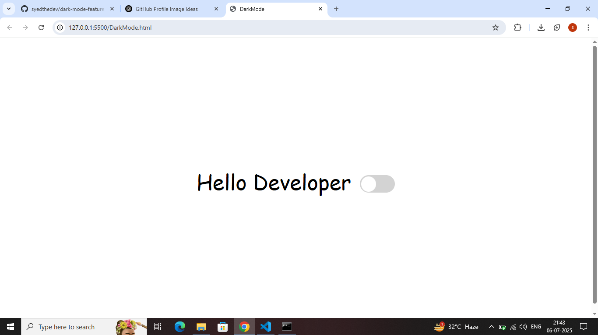
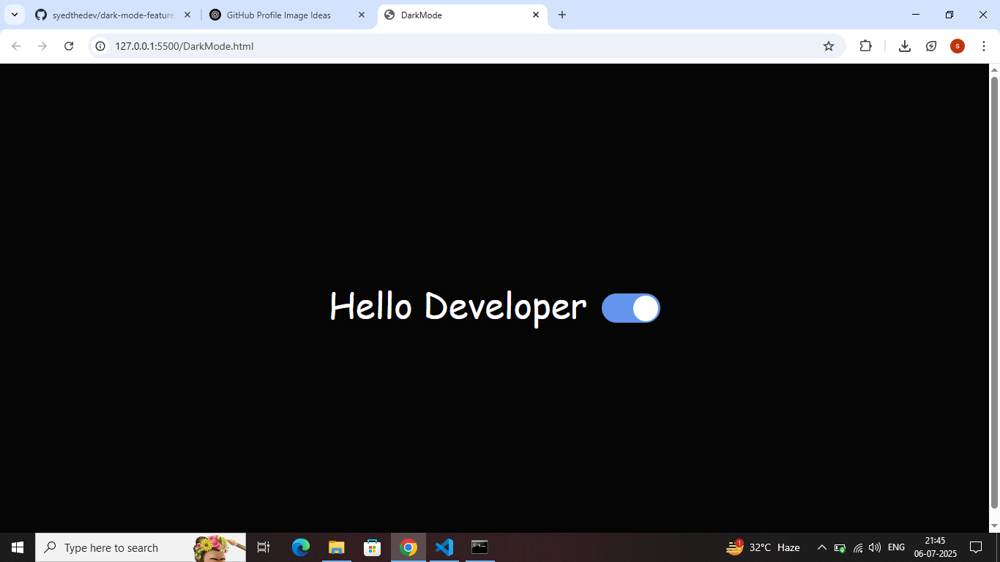

# 🌗 Dark Mode Toggle

A clean, animated dark mode toggle built with **HTML**, **CSS**, and **JavaScript**.  
Easily switch between light and dark themes with a beautiful sliding UI.

---

## 🚀 Features

- 🎛️ Smooth toggle animation
- 🌑 Dark & ☀️ Light mode support
- 🧱 No frameworks – pure HTML/CSS/JS
- 🧠 Simple and beginner-friendly

---

## 📁 Project Files

| File            | Purpose                           |
|------------------|------------------------------------|
| `DarkMode.html`  | Main HTML file                    |
| `DarkMode.css`   | Styling and toggle animations     |
| `DarkMode.js`    | Theme switch logic in JavaScript  |

---

## 🖼️ Preview

### ☀️ Light Mode



---

### 🌙 Dark Mode



---

## ⚙️ How to Use

```bash
# 1. Clone the repository
git clone https://github.com/syedthedev/dark-mode-feature.git

# 2. Navigate to the folder
cd dark-mode-feature

# 3. Run the app
Open DarkMode.html in your browser
